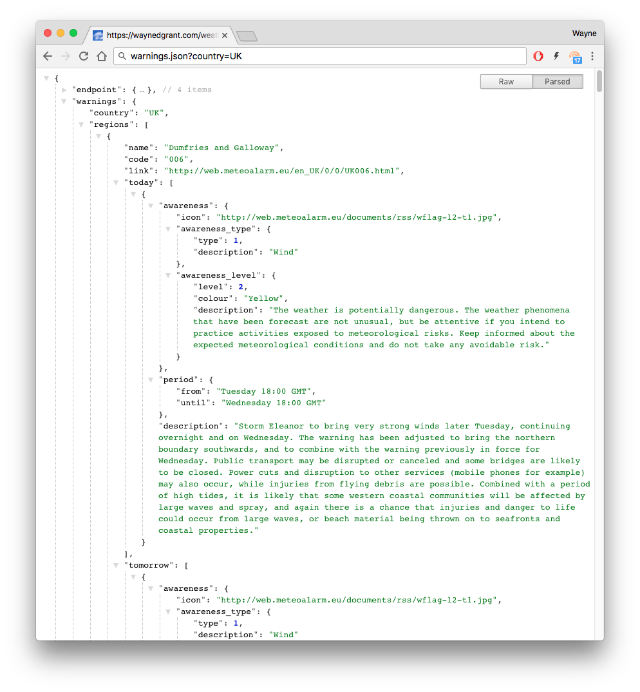

# meteo-alarm-weather-warnings

Copyright © 2018 Wayne D Grant

Licensed under the MIT License

JSON formatted Web Service API to fetch weather warnings from [Metoalarm](http://www.meteoalarm.eu/). Written in PHP.

## Overview

[Metoalarm](http://www.meteoalarm.eu/) is a web site that provides up-to-date weather warnings for most of Europe. While it provides a useful website and RSS feeds it does not, at the time of writing, provide a web service interface.

**meteo-alarm-weather-warnings** remedies this by providing a simple JSON formatted Web Service API that proxies through to Meteoalarm's RSS feeds.



**meteo-alarm-weather-warnings** is especially useful for integrating weather warnings into a 3rd-party website (as has been done here for several UK regions: [https://waynedgrant.com/weather/warn.html](https://waynedgrant.com/weather/warn.html)).

## Requirements

1. PHP version 5 or above installed on the web server

## Installation

* Download the source code for the [latest release](https://github.com/waynedgrant/meteo-alarm-weather-warnings/releases) and unzip it

* Upload all **.php** and **.json** files in **meteo-alarm-weather-warnings/src** to a location on your web server

* Modify your web server to process **.json** files using PHP. For example, for Apache add the following to your **.htaccess** file:

```
AddHandler application/x-httpd-php5 .json
```

* Alternatively rename the **warnings.json** file to be called **warnings.php**

## Execution

Hit the URL of your deployed **warnings.json** file using a web browser or other REST client. Both JSON and JSONP are supported.

The following GET parameters are supported:

| GET Parameter    | Description                                                                                                                                                          | Required? | Default Value          |
|------------------|----------------------------------------------------------------------------------------------------------------------------------------------------------------------|-----------|------------------------|
| country          | Country to fetch weather warnings for. e.g. UK, DE, FR, etc. See [Metoalarm](http://www.meteoalarm.eu/) for a full list of countries.                                | Yes       | N/A                    |
| region           | Region within country to fetch weather warnings for, e.g. 004 is Lothian & Borders in the UK. See [Metoalarm](http://www.meteoalarm.eu/) for a full list of regions. | No        | All regions in country |
| date_time_format | Format string to use for fetched date/time values. See [datetime.createfromformat.php](http://php.net/manual/en/datetime.createfromformat.php) for details.          | No        | l H:i T                |
| time_zone        | Timezone used to express fetched date/time values. See [timezones.php](http://php.net/manual/en/timezones.php) for a full list of supported values.                  | No        | Europe/London          |

For example:

All weather warnings for the UK:

```
/warnings.json?country=UK
```

Weather warnings for the Gelderland region of the Netherlands:

```
/warnings.json?country=NL&region=014
```

Weather warnings for Germany with a specialized date/time format expressed in the local timezone:

```
/warnings.json?country=DE&date_time_format=Y/M/d%20H:i%20T&time_zone=Europe/Berlin
```

## Response Fields

### Success Response

An example of a successful reply:

```
{
    "endpoint": {
        "url": "https://waynedgrant.com/weather/warnings/warnings.json?country=UK",
        "version": "1.0",
        "github_project": "https://github.com/waynedgrant/meteo-alarm-weather-warnings",
        "copyright": "Copyright © 2018 Wayne D Grant (www.waynedgrant.com)"
    },
    "warnings": {
        "country": "UK",
        "regions": [
            {
                "name": "Dumfries and Galloway",
                "code": "006",
                "link": "http://web.meteoalarm.eu/en_UK/0/0/UK006.html",
                "today": [
                    {
                        "awareness": {
                            "awareness_type": {
                                "type": 1,
                                "description": "Wind"
                            },
                            "awareness_level": {
                                "level": 3,
                                "colour": "Amber",
                                "description": "The weather is dangerous. Unusual meteorological phenomena have been forecast. Damage and casualties are likely to happen. Be very vigilant and keep regularly informed about the detailed expected meteorological conditions. Be aware of the risks that might be unavoidable. Follow any advice given by your authorities."
                            }
                        },
                        "period": {
                            "from": "Sunday 03:00 GMT",
                            "until": "Sunday 12:00 GMT"
                        },
                        "description": "Some very strong winds are expected over parts of Northern Ireland and southwest Scotland on New Years Eve. There will probably be some damage to buildings such as tiles blown from roofs, with flying debris likely with the possibility of injuries or danger to life. In coastal areas large waves are likely as well as beach material being thrown onto coastal roads, sea fronts and perhaps some properties. Longer journey times and cancellations are likely as road, rail, air and ferry services may be affected. Some roads and bridges are likely to close. There is also a good chance of power cuts and the potential to affect other services such as mobile phone coverage."
                    },

                    ... any other warnings for today ...
                ],
                "tomorrow": [
                    {
                        ... warnings for tomorrow ...
                    }
                ],
                "published": "Sunday 00:00 GMT"
            },
            {
                ... other regions ...
            }
        ]
    }
}
```

#### Awareness Types

| Code | Type                      |
|------|---------------------------|
| 0    | No Warnings               |
| 1    | Wind                      |
| 2    | Snow/Ice                  |
| 3    | Thunderstorms             |
| 4    | Fog                       |
| 5    | Extreme High Temperatures |
| 6    | Extreme Low Temperatures  |
| 7    | Costal Event              |
| 8    | Forest Fire               |
| 9    | Avalanche                 |
| 10   | Rain                      |
| 11   | Unavailable               |
| 12   | Flooding                  |
| 13   | Rain/Flooding             |

#### Awareness Levels

| Code | Level             |
|------|-------------------|
| 0    | White/Unknown     |
| 1    | Green/No Warnings |
| 2    | Yellow            |
| 3    | Amber             |
| 4    | Red               |

### Failure

Example of failure replies:

```
{
    "error": "GET parameter country is required"
}
```

```
{
"error": "Response code 404 returned by http://www.meteoalarm.eu/documents/rss/NARNIA.rss"
}
```

## Unit Testing

* Install [PHPUnit](https://phpunit.de/)
* cd meteo-alarm-weather-warnings
* phpunit --bootstrap bootstrap.php test/
